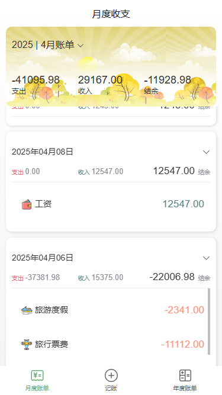
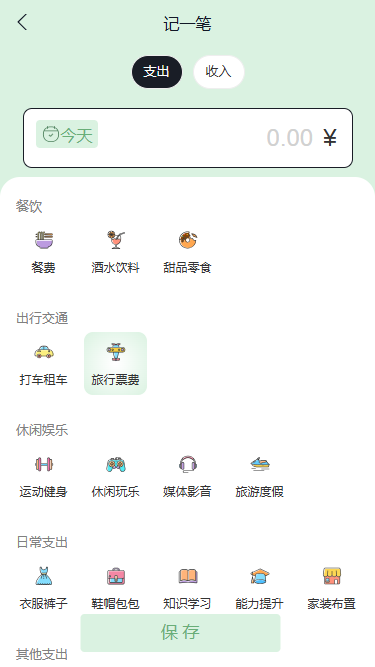
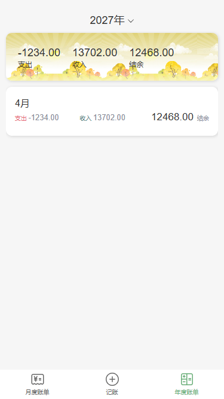
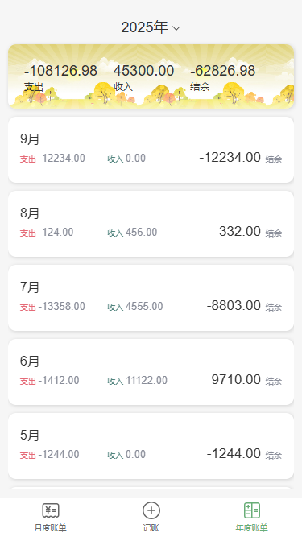

| 中文版本介绍在英文介绍之后

# React Bill Tracker App

This is a mobile accounting app project designed for tracking monthly, annual, and individual bills. The app provides an intuitive interface for managing personal finances and includes features such as monthly bill summaries, adding new bills, and annual financial overviews.

## Features

- **Monthly Bills**: View and manage all bills grouped by month, with detailed daily breakdowns.
- **Add New Bills**: Easily add new income or expense entries with a user-friendly form.
- **Annual Bills**: Get a comprehensive overview of yearly financial data, including total income, expenses, and balance.
- **Responsive Design**: The app uses `rem` units for better adaptability to mobile devices. The base design assumes `1rem = 100px` with a reference width of `375px` (e.g., `16px = 0.16rem`).
- **Enhanced UI**: Improved layout and visual design for a more modern and user-friendly experience.
- **State Memory**: The app remembers the last visited page and its state, ensuring a seamless user experience when navigating back.
- **Auto-Navigation**: After adding a new bill, the app automatically navigates to the relevant date in the monthly bill view.

## Project Details

This project was developed as a self-learning exercise and builds upon an existing accounting app. Key improvements include:

1. **Responsive Design**: Adapted the app for mobile devices using `rem` units for better scaling.
2. **UI Enhancements**: Improved the visual appeal and layout for a more polished look.
3. **New Features**:
   - Auto-navigation to the relevant date after adding a new bill.
   - State memory for returning to the last visited page and its context.

## How to Run

1. Clone the repository.
2. Install dependencies using `npm install`.
3. Start the development server with `npm start`.
4. Open [http://localhost:3000](http://localhost:3000) in your browser to view the app.

## Technologies Used

- **React**: For building the user interface.
- **Redux Toolkit**: For state management.
- **Ant Design Mobile**: For UI components.
- **Day.js**: For date manipulation.
- **Axios**: For API requests.

## Learning Goals

This project was created as part of a self-study initiative to improve skills in:

- Responsive web design for mobile devices.
- State management using Redux Toolkit.
- Enhancing user experience with intuitive navigation and state memory.
- Building scalable and maintainable React applications.

Feel free to explore the code and adapt it for your own projects!

## Example Pages

### Monthly Bill Page

### Add Bill Page

### Annual Bill Page

# React 记账本应用

这是一个移动端记账本应用项目，旨在跟踪月度、年度以及单笔账单。该应用提供了直观的界面，用于管理个人财务，包括月度账单汇总、新增账单以及年度财务概览等功能。

## 功能特点

- **月度账单**：按月查看和管理所有账单，并提供详细的每日账单数据。
- **新增账单**：通过用户友好的表单轻松添加新的收入或支出记录。
- **年度账单**：全面了解年度财务数据，包括总收入、总支出和结余。
- **响应式设计**：应用使用 `rem` 单位以更好地适配移动设备。基础设计假设 `1rem = 100px`，参考宽度为 `375px`（例如，`16px = 0.16rem`）。
- **UI 增强**：改进了布局和视觉设计，使界面更加现代和用户友好。
- **状态记忆**：应用会记住上次访问的页面及其状态，确保返回时的无缝体验。
- **自动跳转**：新增账单后，应用会自动跳转到月度账单视图中的相关日期。

## 项目详情

本项目是一个自学项目，基于现有的记账应用进行了改进。主要改进包括：

1. **响应式设计**：使用 `rem` 单位适配移动设备，提升了可扩展性。
2. **UI 增强**：改进了视觉效果和布局，使界面更加美观。
3. **新增功能**：
   - 新增账单后自动跳转到相关日期。
   - 返回上一个页面时记忆上次访问的状态。

## 如何运行

1. 克隆代码仓库。
2. 使用 `npm install` 安装依赖。
3. 使用 `npm start` 启动开发服务器。
4. 在浏览器中打开 [http://localhost:3000](http://localhost:3000) 查看应用。

## 使用技术

- **React**：用于构建用户界面。
- **Redux Toolkit**：用于状态管理。
- **Ant Design Mobile**：用于 UI 组件。
- **Day.js**：用于日期处理。
- **Axios**：用于 API 请求。

## 学习目标

本项目是自学的一部分，旨在提升以下技能：

- 移动设备的响应式网页设计。
- 使用 Redux Toolkit 进行状态管理。
- 提升用户体验，提供直观的导航和状态记忆功能。
- 构建可扩展且易维护的 React 应用。

## 页面展示

### 月度账单页

### 记账页

### 年度账单页

